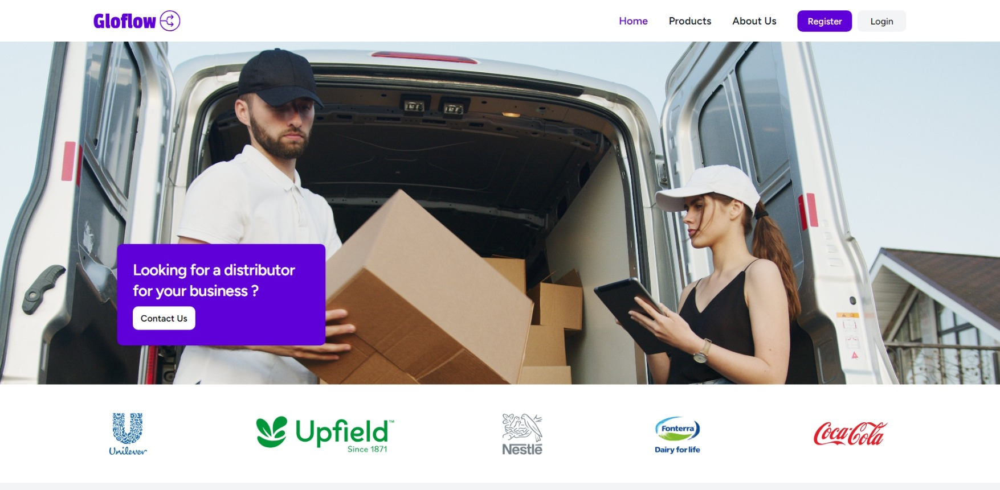
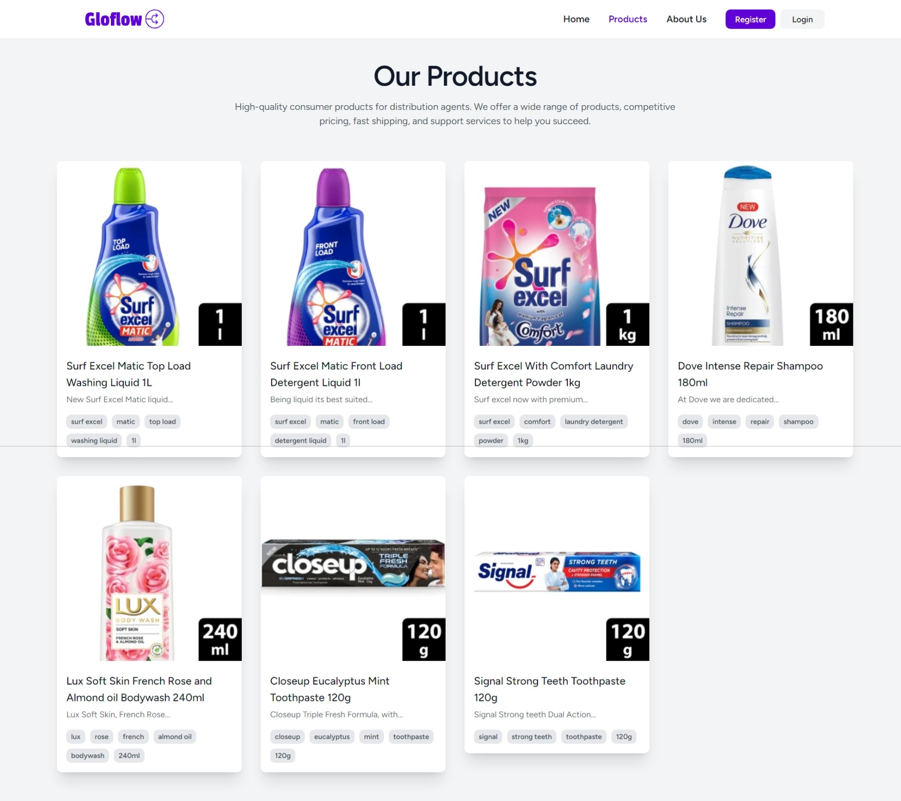
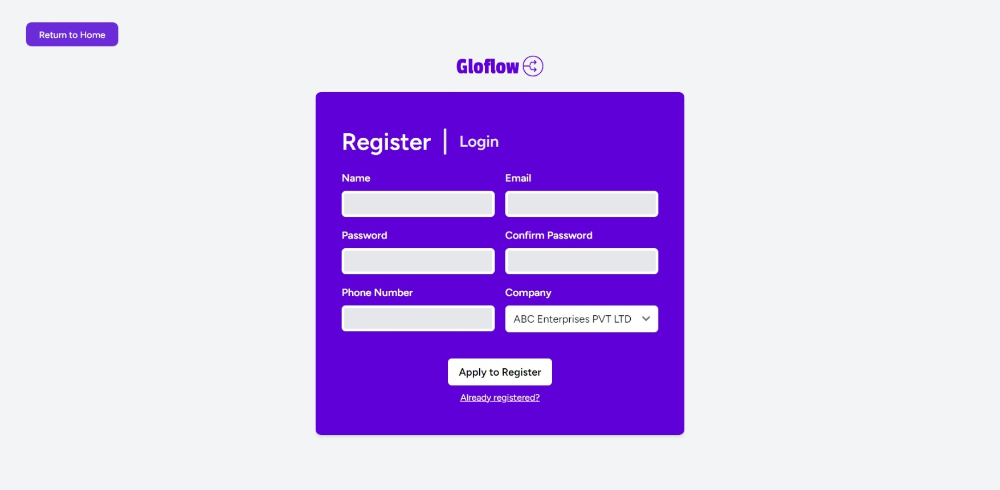
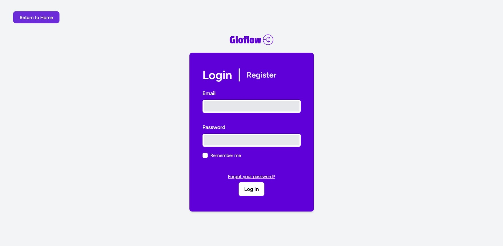
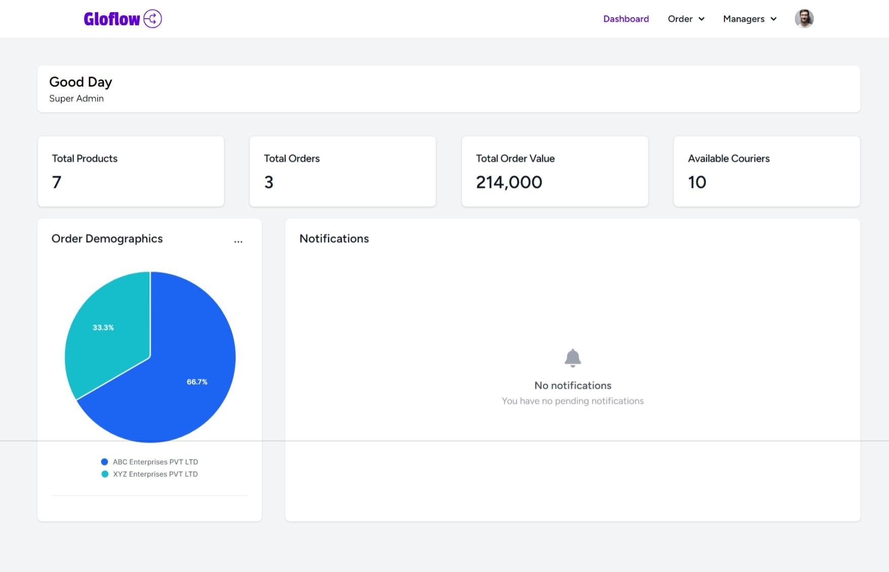
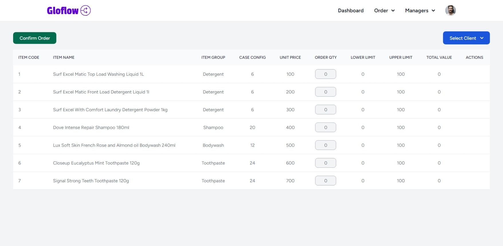
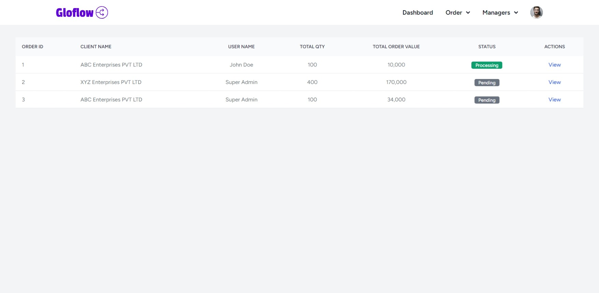
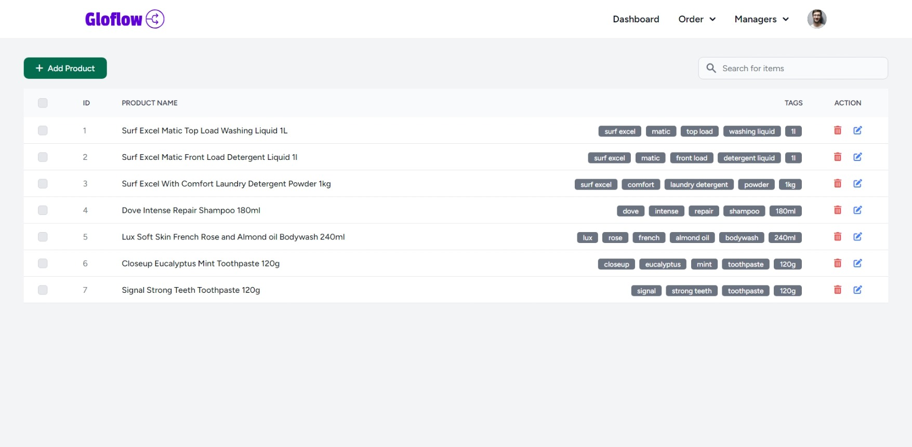
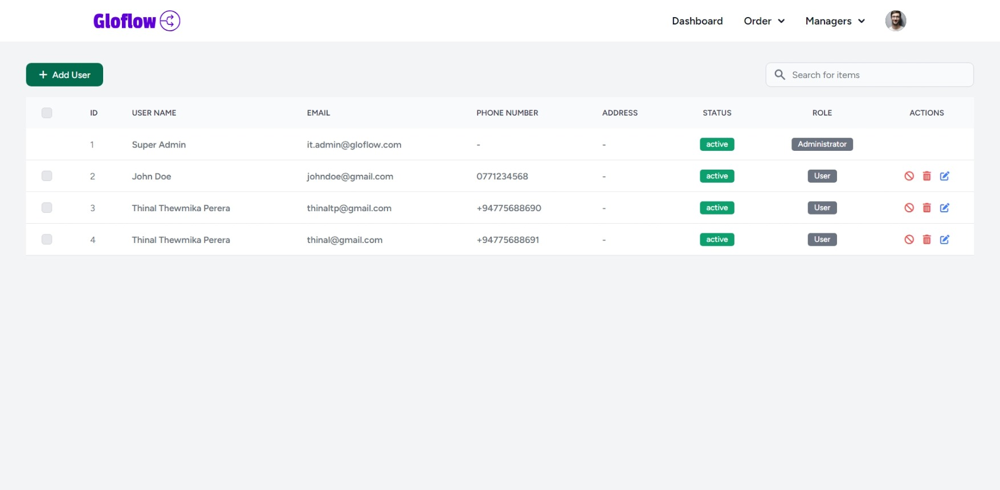
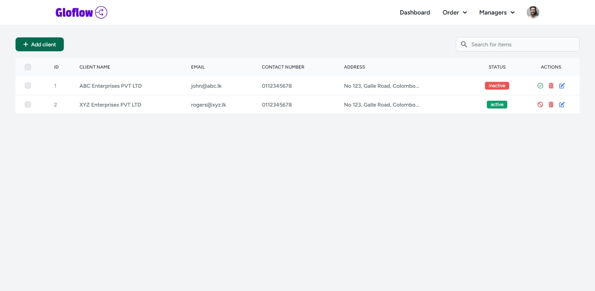

# Gloflow CRM System


## Overview

Introducing the Gloflow CRM (Customer Relationship Management) System, a tailored solution meticulously crafted to meet the distinctive demands encountered by distributor agencies. Harnessing the formidable capabilities of Laravel, Bootstrap, and SQLite, this platform offers an all-encompassing answer that elevates customer interaction, optimizes operational workflows, and guarantees adherence to regulatory requirements.

In an ever-evolving business landscape, Gloflow CRM stands as the quintessential tool for distributor agencies seeking to fortify their customer relationships, operational efficiency, and compliance standards.

## Features

### 1.0 Customer Relationship Management (CRM):

- Comprehensive customer profiles with contact information, purchase history, and communication logs.

### 2.0 Analytics and Reporting:

- Advanced analytics tools for sales forecasting, trend analysis, and performance monitoring.
- Customizable reports and real-time dashboards to visualize key metrics.

### 3.0 User Management and Access Control:

- Role-based user access control for enhanced security and data protection.
- Simple user onboarding and management to tailor access permissions.

### 4.0 Inventory Management:

- Inventory tracking with real-time updates on stock levels and order status.
- Automated alerts for low stock and reordering.

## Technologies Used

- <b>Laravel:</b> A powerful PHP framework for building web applications.
- <b>Tailwind:</b> Tailwind CSS is an open source CSS framework.
- <b>SQLite:</b> A lightweight and easy-to-use database engine.

## Pages

### Home
The landing page for the website in order to provide new clients a brief overview into the services that the oraganisation covers.



### Products
The page in which the organisation is able to list all thier products to be on display as mean of letting the clients know the products that they can purchase from the organisation.




### Register
New users are able to apply for registrations via this page. Once applied for registration, a account creation request will be sent to the managers of the organisation.



### Login
An existing user is able to login to thier account to place orders, view analytics and etc via this page. 



### Dashboard (Admin / Distributor View)
Shows a basic statistical overview relative to each user. Shows any notifications available for the user in the dedicated notifications section in the dashboard.



### Place Order
A user is able to make orders for products that they want to acquire in order to be sold. When a order is placed a new order is added to the database. If a order from that client already exists for that day then it will be updated when a order is placed instead of creating a new one.



### Manage Orders
Authorised personnel will be able to manage all order that are placed through this page. They will be able to view, accept and deny any orders that are placed by clients.



### Products Manager
A CRUD system for the organisation to manage the products that are displayed on the products page.



### Users Manager
A CRUD system for the organisation to manage the users in the system.



### Clients Manager
A CRUD system for the organisation to manage the clients in the system.



## Installation

Follow these steps to set up the Respawn Entertainment CRM system on your local machine:

1. Clone this repository to your local machine:

    ```shell
    git clone https://github.com/DEXOW/gloflow.git
    ```

2. Change to the project directory:

    ```shell
    cd gloflow
    ```

3. Install Composer dependencies:

    ```shell
    composer install
    ```

4. Install NPM dependencies:

    ```shell
    npm install
    ```

5. Create a copy of the `.env.example` file and rename it to `.env`:

    ```shell
    cp .env.example .env
    ```

6. Generate an application key:

    ```shell
    php artisan key:generate
    ```

7. Configure your database connection in the `.env` file:

    ```shell
    DB_CONNECTION=sqlite
    DB_DATABASE=database.sqlite
    ```

8. Migrate the database:

    ```shell
    php artisan migrate
    ```

9. Seed the database:

    ```shell
    php artisan db:seed --class=ProductsSeeder
    php artisan db:seed --class=RolesSeeder
    php artisan db:seed --class=UsersSeeder
    ```

10. Build the frontend:
    ```shell
    npm run build
    ```
11. Start the development server:

    ```shell
    php artisan serve
    ```

12. Visit `http://localhost:8000` or `http://127.0.0.1:8000` in your web browser to access the CRM system.

---

With these steps, you'll have the Gloflow CRM system up and running on your local environment.

Once the Gloflow CRM system is ready, you can login to the dashboard as an admin by locating the login page and entering the following credentials :

    Email : it.admin@gloflow.com
    Password : admin.password